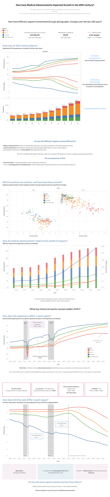

# 📊 How Have Medical Advancements Impacted Growth in the 20th Century?

This Tableau dashboard explores the relationship between **medical advancements** and **population growth trends** during the 20th century. By visualizing historical data, it aims to uncover how improvements in healthcare, vaccinations, and global health policy influenced human development across time and geography.

  

🔗 **[View Interactive Dashboard on Tableau Public](https://public.tableau.com/views/Howhavemedicaladvancementsimpactedgrowthinthe20thcentury/Dashboard1?:language=en-GB&:sid=&:redirect=auth&:display_count=n&:origin=viz_share_link)**

---

## 📚 Project Context

This visualization was created using data from the **Gapminder Foundation**, specifically on **Fertility Rate**, **Life Expectancy**, and **Population**. The dataset forms the foundation of a well-known animated visualization by **Hans Rosling**, the late Swedish academic and data visionary, whose iconic [2006 TED Talk](https://www.ted.com/talks/hans_rosling_the_best_stats_you_ve_ever_seen) demonstrated the power of storytelling through data long before tools like Tableau became mainstream.

---

## 📌 Project Objectives

- Examine how medical innovation correlates with population growth and longevity
- Identify trends across continents in health and demographic shifts
- Highlight the impact of global public health efforts throughout the 20th century

---

## 🔍 Key Insights

- A strong post-WWII improvement in life expectancy globally
- Drop in infant mortality closely tied to access to vaccines and healthcare
- Accelerated population growth in regions with improving medical infrastructure

---

## 🧰 Tools & Technologies

- **Tableau Public** – Interactive data visualization and dashboard design
- **Data Sources** – Gapminder Fertility Rate, Life Expectancy and population Data. World GDP data from the Maddison Project Database.
- **Excel** – For initial data prep and cleaning

---

## 📂 Files Included

- `MedicalAdvancementsDashboard.png` – Static preview of the dashboard  
- `How_Medical_Advancements_Impacted_Growth.twbx` – Packaged Tableau workbook
- `README.md` – This documentation

---

## 📈 Future Enhancements

- Add filters for country-level analysis
- Expand dataset to include early 21st century

---

## 🧠 Author Notes

This project combines an interest in data storytelling, historical analysis, and public health. It was created to explore how **scientific innovation** shapes real-world outcomes—an insight that connects strongly with decision-making in fields like **finance, policy, and technology**.

---

📬 *For questions, feedback, or collaboration opportunities, feel free to reach out via LinkedIn or GitHub!*
