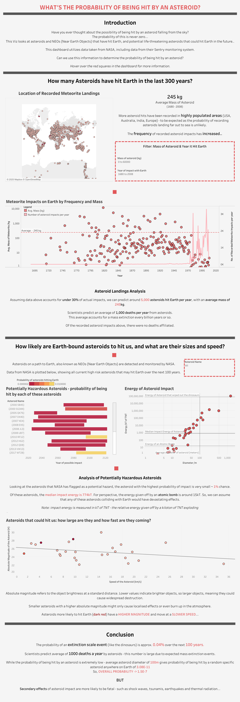

# ☄️ Asteroid Landings: A Global View

This Tableau dashboard presents a visual exploration of **recorded asteroid landings across the globe**, offering insights into where and when these celestial events have occurred throughout history.

🔗 **[View the Interactive Dashboard on Tableau Public](https://public.tableau.com/views/AsteroidLandings_17307978378250/Dashboard12?:language=en-GB&:sid=&:redirect=auth&:display_count=n&:origin=viz_share_link)**

  

---

## 🌍 Project Overview

Asteroids, also known as meteorites when they land on Earth, have been recorded for centuries. This dashboard leverages available data to explore:

- **Geographical distribution** of asteroid landings
- **Time trends** of meteorite impacts by year
- **Size and mass** of landings
- Notable events and outliers

This project aims to make complex astrophysics data more engaging through an interactive dashboard, along with attempting to calculate the rough probability of being hit by an asteroid on any given day using historical data.

---

## 🔍 Key Insights

- High concentration of recorded landings in North America, Europe, and parts of Africa — likely correlated with higher data availability
- Notable mass outliers that suggest exceptionally large impact events
- Spikes in detection post-20th century, reflecting improved scientific tracking of asteroids

---

## 📊 Tech Stack

- **Tableau Public** – For building the interactive dashboard
- **Python / Excel** pre-processing of data
- **Open meteorite landing datasets** – [NASA Sentry](https://cneos.jpl.nasa.gov/sentry/) and [Kaggle](https://www.kaggle.com/datasets/nasa/meteorite-landings)

---

## 📁 Files
- `Asteroid_Landings.twbx` – Tableau Packaged Workbook 
- `dashboard_screenshot.png` – Static image of the dashboard for preview
- `README.md` – This documentation

---

## 🔮 Future Improvements

- Integrate NASA API for real-time NEO (Near-Earth Object) tracking
- Annotate major historical meteorite landings (e.g. Chelyabinsk, Tunguska)

---

## 🧠 Author Notes
This project is part of a broader portfolio aimed at showcasing skills in **data visualization** and **data analysis**.  

This was my first attempt at using tableau, and I absolutely love the software (albeit slightly depressing that I've been fighting with matplotlib all these years when tableau does it in seconds)! 
Being interested in astrophysics, calculating the probability of being hit by an asteroid seemed like a fun way to develop my data analysis skills in line with my BSc degree in Physics.  
I hope you find it interesting too!

